# 🏗️ DiyetKent - Teknik Mimari Dokümantasyonu

## 📋 İçindekiler
- [Sistem Mimarisi Genel Bakış](#sistem-mimarisi-genel-bakış)
- [Hibrit Database Mimarisi](#hibrit-database-mimarisi)
- [Frontend Mimarisi](#frontend-mimarisi)
- [Backend Services](#backend-services)
- [Data Flow ve Sync Strategy](#data-flow-ve-sync-strategy)
- [Security Architecture](#security-architecture)
- [Performance Optimization](#performance-optimization)

---

## 🌐 Sistem Mimarisi Genel Bakış

### 🏛️ **High-Level Architecture**

```mermaid
graph TB
    User[👤 User Mobile App] --> FlutterApp[📱 Flutter Application]
    FlutterApp --> DriftDB[(🗃️ Drift Database<br/>SQLite Local)]
    FlutterApp --> Firebase[☁️ Firebase Services]
    
    Firebase --> Auth[🔐 Authentication]
    Firebase --> Firestore[(📄 Firestore<br/>Cloud Database)]
    Firebase --> Storage[📁 Firebase Storage]
    Firebase --> Messaging[📨 FCM Messaging]
    
    FlutterApp --> External[🌐 External APIs]
    External --> WebRTC[📞 WebRTC Calls]
    External --> Health[🏥 Health APIs]
    External --> PDF[📄 PDF Generator]
    
    Admin[👩‍⚕️ Admin User] --> AdminPanel[⚙️ Admin Panel]
    AdminPanel --> FlutterApp
```



### 🎯 **Mimari Prensipleri**

#### 1. **Offline-First Strategy**
```yaml
Primary Database: Drift (SQLite)
  - UI tamamen lokal veriden çalışır
  - Network bağımsız temel fonksiyonalite
  - Instant response times
  
Cloud Sync: Firebase Firestore
  - Background senkronizasyon
  - Conflict resolution
  - Multi-device consistency
```

#### 2. **Cost-Optimized Architecture**
```yaml
Firebase Read Optimization:
  - UI: %0 Firebase reads
  - Background Service: Smart sync
  - Cache Strategy: 100MB local cache
  - Result: %70 cost reduction
```

#### 3. **Modular Service Design**
```yaml
Service Layer:
  - 52 specialized services
  - Dependency injection ready
  - Testable architecture
  - Clear separation of concerns
```

---

## 🗄️ Hibrit Database Mimarisi

### 📊 **Database Strategy Overview**

```mermaid
graph LR
    UI[🖥️ UI Layer] --> DriftService[🔄 DriftService]
    DriftService --> Drift[(🗃️ Drift SQLite)]
    
    Background[🔄 Background Sync] --> Firebase[(☁️ Firebase Firestore)]
    Background --> DriftService
    
    DriftService -.-> Models[📦 Data Models]
    Models -.-> UI
```



### 🏗️ **Drift Database Schema**

#### **Core Tables**
```sql
-- Ana Tablolar
TABLE users (
  id INTEGER PRIMARY KEY,
  userId TEXT UNIQUE,
  name TEXT,
  phoneNumber TEXT,
  profileImageUrl TEXT,
  currentHeight REAL,
  currentWeight REAL,
  age INTEGER,
  userRole TEXT CHECK (userRole IN ('user', 'dietitian', 'admin')),
  isOnline BOOLEAN DEFAULT FALSE,
  lastSeen DATETIME,
  createdAt DATETIME DEFAULT CURRENT_TIMESTAMP,
  updatedAt DATETIME DEFAULT CURRENT_TIMESTAMP
);

TABLE chats (
  id INTEGER PRIMARY KEY,
  chatId TEXT UNIQUE,
  isGroup BOOLEAN DEFAULT FALSE,
  groupId TEXT,
  otherUserId TEXT,
  otherUserName TEXT,
  lastMessage TEXT,
  lastMessageTime DATETIME,
  unreadCount INTEGER DEFAULT 0,
  isPinned BOOLEAN DEFAULT FALSE,
  isArchived BOOLEAN DEFAULT FALSE,
  tags TEXT, -- JSON array
  createdAt DATETIME DEFAULT CURRENT_TIMESTAMP,
  updatedAt DATETIME DEFAULT CURRENT_TIMESTAMP
);

TABLE messages (
  id INTEGER PRIMARY KEY,
  messageId TEXT UNIQUE,
  chatId TEXT,
  senderId TEXT,
  content TEXT,
  type TEXT CHECK (type IN ('text', 'image', 'video', 'audio', 'document', 'location')),
  status TEXT CHECK (status IN ('sending', 'sent', 'delivered', 'read', 'failed')),
  mediaUrl TEXT,
  mediaLocalPath TEXT,
  mediaThumbnailUrl TEXT,
  replyToMessageId TEXT,
  isEdited BOOLEAN DEFAULT FALSE,
  timestamp DATETIME DEFAULT CURRENT_TIMESTAMP,
  deliveredAt DATETIME,
  readAt DATETIME,
  
  FOREIGN KEY (chatId) REFERENCES chats(chatId),
  FOREIGN KEY (senderId) REFERENCES users(userId)
);
```

#### **Specialized Tables**
```sql
-- Sağlık ve Diyet Tabloları
TABLE diet_packages (
  id INTEGER PRIMARY KEY,
  packageId TEXT UNIQUE,
  name TEXT NOT NULL,
  description TEXT,
  totalDuration INTEGER, -- days
  targetWeightChange REAL,
  season TEXT, -- 'spring', 'summer', 'autumn', 'winter', 'all'
  createdBy TEXT,
  isActive BOOLEAN DEFAULT TRUE,
  createdAt DATETIME DEFAULT CURRENT_TIMESTAMP
);

TABLE diet_files (
  id INTEGER PRIMARY KEY,
  fileId TEXT UNIQUE,
  packageId TEXT,
  name TEXT,
  filePath TEXT,
  bmiRange TEXT, -- '21-25', '26-29', etc.
  duration INTEGER, -- days
  expectedWeightChange REAL,
  
  FOREIGN KEY (packageId) REFERENCES diet_packages(packageId)
);

TABLE user_diet_assignments (
  id INTEGER PRIMARY KEY,
  assignmentId TEXT UNIQUE,
  userId TEXT,
  packageId TEXT,
  dietitianId TEXT,
  startDate DATETIME,
  endDate DATETIME,
  currentPhase INTEGER DEFAULT 1,
  isActive BOOLEAN DEFAULT TRUE,
  
  FOREIGN KEY (userId) REFERENCES users(userId),
  FOREIGN KEY (packageId) REFERENCES diet_packages(packageId),
  FOREIGN KEY (dietitianId) REFERENCES users(userId)
);

TABLE health_data (
  id INTEGER PRIMARY KEY,
  userId TEXT,
  weight REAL,
  height REAL,
  bmi REAL,
  targetWeight REAL,
  recordDate DATETIME DEFAULT CURRENT_TIMESTAMP,
  
  FOREIGN KEY (userId) REFERENCES users(userId)
);
```

### 🔄 **Data Access Patterns**

#### **DriftService Architecture**
```dart
class DriftService {
  // Singleton pattern
  static AppDatabase? _database;
  static AppDatabase get database => _database ??= AppDatabase.instance;
  
  // Generic CRUD operations
  static Future<void> saveChat(ChatModel chat) async {
    final companion = ChatsCompanion.insert(/* ... */);
    await database.chatDao.saveChat(companion);
  }
  
  // Stream-based reactive queries
  static Stream<List<ChatModel>> watchAllChats() {
    return database.chatDao.watchActiveChats()
        .map((chats) => chats.map(convertChatModel).toList());
  }
  
  // Conversion utilities
  static ChatModel convertChatModel(Chat chat) {
    return ChatModel.create(/* ... */);
  }
}
```

---

## 📱 Frontend Mimarisi

### 🎯 **Flutter App Structure**

```
📁 lib/
├── 📁 main.dart                    # App entry point
├── 📁 database/                    # Data layer
│   ├── drift/                      # Drift database
│   │   ├── database.dart           # Main database class
│   │   ├── tables/                 # Table definitions
│   │   └── daos/                   # Data Access Objects
│   └── drift_service.dart          # Service abstraction
├── 📁 models/                      # Data models
├── 📁 providers/                   # State management
├── 📁 services/                    # Business logic (52 services)
├── 📁 pages/                       # UI screens (32 pages)
├── 📁 widgets/                     # Custom widgets
└── 📁 utils/                       # Helper utilities
```

### 🧩 **State Management Architecture**

#### **Provider Pattern Implementation**
```dart
// Main App Providers
MultiProvider(
  providers: [
    ChangeNotifierProvider(create: (_) => OptimizedChatProvider()),
    ChangeNotifierProvider(create: (_) => TagProvider()),
    ChangeNotifierProvider(create: (_) => StoryProvider()),
    ChangeNotifierProvider(create: (_) => GroupProvider()),
    ChangeNotifierProvider(create: (_) => PreConsultationFormProvider()),
  ],
  child: MaterialApp(/* ... */)
)

// Provider Architecture Pattern
abstract class BaseProvider extends ChangeNotifier {
  bool _isLoading = false;
  String? _errorMessage;
  
  bool get isLoading => _isLoading;
  String? get errorMessage => _errorMessage;
  
  @protected
  void setLoading(bool loading) {
    _isLoading = loading;
    notifyListeners();
  }
  
  @protected 
  void setError(String? error) {
    _errorMessage = error;
    notifyListeners();
  }
}
```

#### **OptimizedChatProvider Example**
```dart
class OptimizedChatProvider extends BaseProvider {
  List<ChatModel> _chats = [];
  List<MessageModel> _currentMessages = [];
  StreamSubscription? _chatsSubscription;
  
  // Reactive data streams
  void initialize() {
    _chatsSubscription = DriftService.watchAllChats().listen(
      (chats) {
        _chats = chats;
        notifyListeners();
      },
      onError: (error) => setError(error.toString()),
    );
  }
  
  // Business logic methods
  Future<void> sendMessage(MessageModel message) async {
    try {
      setLoading(true);
      await DriftService.saveMessage(message);
      // Background service handles Firebase sync
    } catch (e) {
      setError(e.toString());
    } finally {
      setLoading(false);
    }
  }
}
```

### 🎨 **Custom Widget Architecture**

#### **Widget Kategorileri**
```dart
// 1. Base Widgets - Temel UI bileşenleri
abstract class BaseWidget extends StatelessWidget {
  const BaseWidget({Key? key}) : super(key: key);
  
  @protected
  Widget buildContent(BuildContext context);
  
  @override
  Widget build(BuildContext context) {
    return buildContent(context);
  }
}

// 2. Chat-specific widgets
class ChatTile extends BaseWidget {
  final ChatModel chat;
  final VoidCallback? onTap;
  
  const ChatTile({Key? key, required this.chat, this.onTap}) : super(key: key);
  
  @override
  Widget buildContent(BuildContext context) {
    return ListTile(
      leading: _buildAvatar(),
      title: _buildTitle(),
      subtitle: _buildSubtitle(),
      trailing: _buildTrailing(),
      onTap: onTap,
    );
  }
}

// 3. Health widgets
class BMIIndicator extends BaseWidget {
  final double bmi;
  final bool isCompact;
  
  const BMIIndicator({Key? key, required this.bmi, this.isCompact = false}) 
    : super(key: key);
}
```

---

## ☁️ Backend Services

### 🔥 **Firebase Services Integration**

#### **Firebase Configuration**
```dart
// Firebase initialization
await Firebase.initializeApp(
  options: DefaultFirebaseOptions.currentPlatform,
);

// Firestore optimization
FirebaseFirestore.instance.settings = const Settings(
  persistenceEnabled: true,
  cacheSizeBytes: 100 * 1024 * 1024, // 100MB cache
);

// App Check for security
await FirebaseAppCheck.instance.activate(
  androidProvider: AndroidProvider.debug,
  appleProvider: AppleProvider.debug,
);
```

#### **Service Architecture**
```dart
// 1. Authentication Service
class AuthService {
  static final FirebaseAuth _auth = FirebaseAuth.instance;
  
  static Future<UserCredential?> signInWithPhone(String phoneNumber) async {
    // SMS verification implementation
  }
  
  static Stream<User?> get authStateChanges => _auth.authStateChanges();
}

// 2. Firebase Background Sync Service
class FirebaseBackgroundSyncService {
  static Timer? _syncTimer;
  
  static Future<void> initialize() async {
    _startSyncTimer();
  }
  
  static void _startSyncTimer() {
    _syncTimer = Timer.periodic(Duration(minutes: 5), (timer) {
      _performSync();
    });
  }
  
  static Future<void> _performSync() async {
    // Smart sync implementation
    await _syncChats();
    await _syncMessages();
    await _syncUsers();
  }
}

// 3. Connection-Aware Sync Service  
class ConnectionAwareSyncService {
  static StreamSubscription? _connectivitySubscription;
  
  static Future<void> initialize() async {
    _connectivitySubscription = Connectivity().onConnectivityChanged.listen(
      (ConnectivityResult result) {
        if (result != ConnectivityResult.none) {
          FirebaseBackgroundSyncService.triggerSync();
        }
      },
    );
  }
}
```

### 🎯 **Specialized Business Services**

#### **BMI Calculation Engine**
```dart
class BMICalculationEngine {
  // Age-based ideal weight calculation
  static double calculateIdealWeight(double height, int age) {
    if (age < 35) return height * height * 21;
    if (age < 45) return height * height * 22;
    return height * height * 23;
  }
  
  static double calculateMaxWeight(double height, int age) {
    if (age < 35) return height * height * 27;
    if (age < 45) return height * height * 28;  
    return height * height * 30;
  }
  
  static String getBMICategory(double bmi) {
    if (bmi < 18.5) return 'Underweight';
    if (bmi < 25) return 'Normal';
    if (bmi < 30) return 'Overweight';
    return 'Obese';
  }
}
```

#### **Diet Assignment Engine**
```dart
class DietAssignmentEngine {
  static Future<DietFileModel?> selectDietFile(
    String packageId, 
    double userBMI
  ) async {
    // Get BMI range
    String bmiRange = _getBMIRange(userBMI);
    
    // Find matching diet file
    final dietFiles = await DriftService.getDietFilesByPackage(packageId);
    return dietFiles.firstWhere(
      (file) => file.bmiRange == bmiRange,
      orElse: () => null,
    );
  }
  
  static String _getBMIRange(double bmi) {
    if (bmi >= 21 && bmi <= 25) return '21-25';
    if (bmi >= 26 && bmi <= 29) return '26-29';
    if (bmi >= 30 && bmi <= 33) return '30-33';
    return '34-37';
  }
}
```

#### **PDF Generation Service**
```dart
class PDFGenerationService {
  static Future<String> generatePersonalizedDiet({
    required DietFileModel dietFile,
    required UserModel user,
    required DateTime startDate,
    required DateTime endDate,
  }) async {
    
    // Read DOCX template
    final docxBytes = await File(dietFile.filePath).readAsBytes();
    final docxContent = await _parseDocx(docxBytes);
    
    // Replace placeholders
    final personalizedContent = docxContent
      .replaceAll('{NAME}', user.name)
      .replaceAll('{WEIGHT}', user.currentWeight.toString())
      .replaceAll('{BMI}', _calculateBMI(user).toString())
      .replaceAll('{START_DATE}', _formatDate(startDate))
      .replaceAll('{END_DATE}', _formatDate(endDate));
    
    // Generate PDF
    final pdf = pw.Document();
    pdf.addPage(pw.Page(
      build: (pw.Context context) => pw.Text(personalizedContent),
    ));
    
    // Save PDF
    final fileName = '${user.name}_${_formatDate(startDate)}.pdf';
    final filePath = await _savePDF(pdf, fileName);
    
    return filePath;
  }
}
```

---

## 🔄 Data Flow ve Sync Strategy

### 📊 **Data Flow Architecture**

```mermaid
sequenceDiagram
    participant UI as 🖥️ UI Layer
    participant Provider as 🔄 Provider
    participant Service as 🛠️ DriftService
    participant Local as 🗃️ Local DB
    participant Background as 🔄 Background Sync
    participant Firebase as ☁️ Firebase
    
    UI->>Provider: User Action
    Provider->>Service: Business Logic
    Service->>Local: Write Data
    Local->>Service: Return Data
    Service->>Provider: Updated Data
    Provider->>UI: UI Update
    
    Background->>Local: Check Changes
    Background->>Firebase: Sync to Cloud
    Firebase->>Background: Confirm Sync
    Background->>Local: Update Sync Status
```



### ⚡ **Performance Optimized Patterns**

#### **1. Lazy Loading Strategy**
```dart
class LazyLoadingService {
  static final Map<String, dynamic> _cache = {};
  
  static Future<T> lazyLoad<T>(
    String key,
    Future<T> Function() loader,
  ) async {
    if (_cache.containsKey(key)) {
      return _cache[key] as T;
    }
    
    final data = await loader();
    _cache[key] = data;
    return data;
  }
}
```

#### **2. Smart Caching System**
```dart
class MediaCacheManager {
  static const int MAX_CACHE_SIZE = 100 * 1024 * 1024; // 100MB
  
  static Future<String> cacheMedia(String url) async {
    final cachedFile = await _getCachedFile(url);
    if (await cachedFile.exists()) {
      return cachedFile.path;
    }
    
    // Download and cache
    final response = await http.get(Uri.parse(url));
    await cachedFile.writeAsBytes(response.bodyBytes);
    
    _checkCacheSize();
    return cachedFile.path;
  }
  
  static Future<void> _checkCacheSize() async {
    final cacheDir = await _getCacheDirectory();
    final files = await cacheDir.list().toList();
    
    int totalSize = 0;
    for (var file in files) {
      if (file is File) {
        totalSize += await file.length();
      }
    }
    
    if (totalSize > MAX_CACHE_SIZE) {
      await _cleanOldCache();
    }
  }
}
```

---

## 🔐 Security Architecture

### 🛡️ **Multi-Layer Security Model**

```mermaid
graph TB
    App[📱 Flutter App] --> AppCheck[🔒 Firebase App Check]
    AppCheck --> Auth[🔐 Firebase Auth]
    Auth --> Rules[📋 Firestore Rules]
    Rules --> Data[🗄️ Encrypted Data]
    
    App --> LocalSec[🔐 Local Security]
    LocalSec --> Encryption[🔒 SQLite Encryption]
    LocalSec --> Keychain[🔑 Secure Storage]
```



#### **1. Firebase Security Rules**
```javascript
// Firestore Security Rules
rules_version = '2';
service cloud.firestore {
  match /databases/{database}/documents {
    // Users can only access their own data
    match /users/{userId} {
      allow read, write: if request.auth != null 
        && request.auth.uid == userId;
    }
    
    // Chat access control
    match /chats/{chatId} {
      allow read, write: if request.auth != null 
        && (request.auth.uid in resource.data.participants);
    }
    
    // Admin-only diet packages
    match /diet_packages/{packageId} {
      allow read: if request.auth != null;
      allow write: if request.auth != null 
        && getUserRole(request.auth.uid) in ['dietitian', 'admin'];
    }
  }
  
  function getUserRole(userId) {
    return get(/databases/$(database)/documents/users/$(userId)).data.role;
  }
}
```

#### **2. Local Data Encryption**
```dart
class SecureStorageService {
  static const FlutterSecureStorage _storage = FlutterSecureStorage(
    aOptions: AndroidOptions(
      encryptedSharedPreferences: true,
    ),
    iOptions: IOSOptions(
      accessibility: IOSAccessibility.first_unlock_this_device,
    ),
  );
  
  static Future<void> storeSecureData(String key, String value) async {
    await _storage.write(key: key, value: value);
  }
  
  static Future<String?> getSecureData(String key) async {
    return await _storage.read(key: key);
  }
}
```

#### **3. API Security Implementation**
```dart
class SecurityService {
  static String generateSecureToken() {
    final random = Random.secure();
    final bytes = List<int>.generate(32, (_) => random.nextInt(256));
    return base64Url.encode(bytes);
  }
  
  static bool validateUserPermission(UserRole role, String operation) {
    switch (operation) {
      case 'DELETE_USER':
        return role == UserRole.admin;
      case 'CREATE_DIET_PACKAGE':
        return [UserRole.dietitian, UserRole.admin].contains(role);
      case 'VIEW_ALL_USERS':
        return [UserRole.dietitian, UserRole.admin].contains(role);
      default:
        return true;
    }
  }
}
```

---

## ⚡ Performance Optimization

### 🚀 **Memory Management Strategy**

#### **1. Image Optimization**
```dart
class ImageOptimizationService {
  static Future<Uint8List> compressImage(
    Uint8List imageBytes, {
    int quality = 85,
    int maxWidth = 1024,
  }) async {
    return await FlutterImageCompress.compressWithList(
      imageBytes,
      quality: quality,
      minWidth: maxWidth,
    );
  }
  
  static Widget buildOptimizedImage(String url) {
    return CachedNetworkImage(
      imageUrl: url,
      placeholder: (context, url) => CircularProgressIndicator(),
      errorWidget: (context, url, error) => Icon(Icons.error),
      memCacheWidth: 300,  // Limit memory usage
      fadeInDuration: Duration(milliseconds: 300),
    );
  }
}
```

#### **2. Database Query Optimization**
```dart
class QueryOptimizationService {
  // Paginated queries for large datasets
  static Future<List<MessageModel>> getMessagesPaginated(
    String chatId, {
    int limit = 50,
    String? lastMessageId,
  }) async {
    var query = database.messageDao.getMessagesByChatIdQuery(chatId)
      ..limit(limit);
    
    if (lastMessageId != null) {
      query = query..where((msg) => msg.messageId.isSmallerThan(lastMessageId));
    }
    
    final messages = await query.get();
    return messages.map((msg) => DriftService.convertToMessageModel(msg)).toList();
  }
  
  // Indexed queries for better performance
  static Future<List<ChatModel>> searchChats(String query) async {
    // Uses full-text search index
    final chats = await (database.select(database.chats)
      ..where((chat) => chat.otherUserName.contains(query) |
                        chat.lastMessage.contains(query))
    ).get();
    
    return chats.map((chat) => DriftService.convertChatModel(chat)).toList();
  }
}
```

#### **3. Background Processing Optimization**
```dart
class BackgroundOptimizationService {
  static Future<void> performMaintenanceTasks() async {
    await Future.wait([
      _cleanExpiredStories(),
      _compactDatabase(), 
      _clearMediaCache(),
      _syncPendingMessages(),
    ]);
  }
  
  static Future<void> _compactDatabase() async {
    await database.customStatement('VACUUM');
    await database.customStatement('ANALYZE');
  }
  
  static Future<void> _clearMediaCache() async {
    final cacheDir = await getTemporaryDirectory();
    await MediaCacheManager.performAutoCleanup();
  }
}
```

---

## 📊 Monitoring ve Analytics

### 📈 **Performance Monitoring**
```dart
class PerformanceMonitoringService {
  static Future<void> trackScreenLoad(String screenName) async {
    final trace = FirebasePerformance.instance.newTrace('screen_load_$screenName');
    await trace.start();
    
    // Track metrics
    trace.setMetric('memory_usage', await _getMemoryUsage());
    trace.setMetric('database_queries', DatabaseMetrics.queryCount);
    
    await trace.stop();
  }
  
  static Future<void> trackCustomMetric(String name, double value) async {
    await FirebaseAnalytics.instance.logEvent(
      name: 'custom_metric',
      parameters: {
        'metric_name': name,
        'metric_value': value,
        'timestamp': DateTime.now().toIso8601String(),
      },
    );
  }
}
```

---

## 🔄 Migration ve Versioning

### 📦 **Database Migration Strategy**
```dart
class MigrationService {
  // Isar to Drift migration (completed)
  static Future<void> migrateFromIsarToDrift() async {
    // Migration implementation was completed
    debugPrint('✅ Migration from Isar to Drift completed');
  }
  
  // Future migrations
  static Future<void> handleMigration(int fromVersion, int toVersion) async {
    for (int version = fromVersion + 1; version <= toVersion; version++) {
      await _runMigration(version);
    }
  }
  
  static Future<void> _runMigration(int version) async {
    switch (version) {
      case 2:
        await _addHealthDataTable();
        break;
      case 3:
        await _addDietPackageOptimizations();
        break;
      // Future migrations...
    }
  }
}
```

---

## 🎯 Sonuç

Bu mimari dokümantasyon, DiyetKent projesinin teknik altyapısının kapsamlı bir görünümünü sunar. Sistem şu temel prensipler üzerine kurulmuştur:

### ✅ **Başarı Faktörleri**
- **Offline-First**: Kullanıcı deneyimi önceliği
- **Cost-Optimized**: %70 Firebase maliyet azaltımı
- **Modular Design**: 52 servis ile ölçeklenebilir yapı
- **Security-First**: Çok katmanlı güvenlik modeli

### 🚀 **Gelecek Geliştirmeler**
- Microservices mimarisine geçiş
- GraphQL API entegrasyonu  
- Real-time collaboration features
- AI/ML entegrasyonu

---

**Son Güncelleme**: 2024-01-11  
**Doküman Versiyonu**: 1.0.0  
**Teknik Lead**: Kenfroz