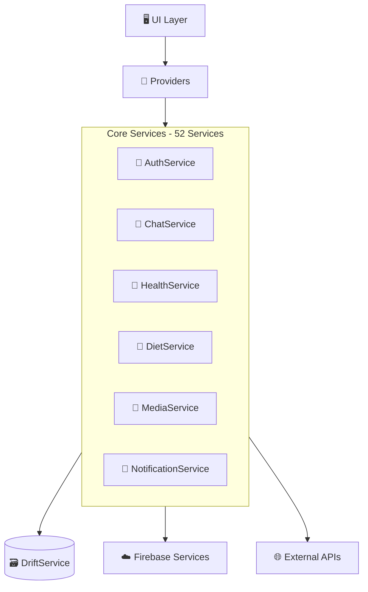

# 🔌 DiyetKent - API ve Servis Dokümantasyonu

## 📋 İçindekiler
- [Servis Mimarisi Genel Bakış](#servis-mimarisi-genel-bakış)
- [Core Services](#core-services)
- [Firebase Services](#firebase-services)
- [Specialized Business Services](#specialized-business-services)
- [Utility Services](#utility-services)
- [API Endpoints](#api-endpoints)
- [Error Handling](#error-handling)
- [Performance Monitoring](#performance-monitoring)

---

## 🌐 Servis Mimarisi Genel Bakış

### 🏗️ **Service Layer Architecture**

DiyetKent, **52 özel servis** ile modüler bir mimari kullanır:



### 📊 **Service Categories**

| Kategori | Servis Sayısı | Açıklama |
|----------|--------------|----------|
| **Core Services** | 8 | Temel sistem servisleri |
| **Communication** | 12 | Mesajlaşma ve iletişim |
| **Health & Diet** | 15 | Sağlık takibi ve diyet yönetimi |
| **Background Services** | 8 | Arka plan işlemleri |
| **Utility Services** | 9 | Yardımcı ve destek servisleri |
| **TOPLAM** | **52** | **Tüm servisler** |

---

## 🛠️ Core Services

### 🔐 **1. AuthService**
Kullanıcı kimlik doğrulama ve yetkilendirme işlemleri.

```dart
class AuthService {
  static final FirebaseAuth _auth = FirebaseAuth.instance;
  
  /// Phone number ile SMS doğrulama başlat
  static Future<String> sendSMSVerification(String phoneNumber) async {
    final completer = Completer<String>();
    
    await _auth.verifyPhoneNumber(
      phoneNumber: phoneNumber,
      timeout: const Duration(seconds: 60),
      verificationCompleted: (PhoneAuthCredential credential) async {
        // Auto-verification completed
        await _auth.signInWithCredential(credential);
      },
      verificationFailed: (FirebaseAuthException e) {
        completer.completeError(e);
      },
      codeSent: (String verificationId, int? resendToken) {
        completer.complete(verificationId);
      },
    );
    
    return completer.future;
  }
  
  /// SMS kodunu doğrula ve giriş yap
  static Future<UserCredential> verifyOTPAndSignIn(
    String verificationId,
    String otpCode,
  ) async {
    final credential = PhoneAuthProvider.credential(
      verificationId: verificationId,
      smsCode: otpCode,
    );
    
    return await _auth.signInWithCredential(credential);
  }
  
  /// Kullanıcı oturum durumunu dinle
  static Stream<User?> get authStateChanges => _auth.authStateChanges();
  
  /// Çıkış yap
  static Future<void> signOut() async {
    await _auth.signOut();
    await DriftService.clearAll(); // Local verileri temizle
  }
  
  /// Mevcut kullanıcıyı al
  static User? get currentUser => _auth.currentUser;
  
  /// Kullanıcı giriş yapmış mı?
  static bool get isLoggedIn => currentUser != null;
}
```

### 👤 **2. UserService**
Kullanıcı profil yönetimi ve durumu.

```dart
class UserService {
  static Timer? _onlineStatusTimer;
  
  /// Kullanıcı profilini kaydet
  static Future<void> saveUserProfile({
    required String name,
    String? about,
    double? height,
    double? weight,
    int? age,
    DateTime? birthDate,
    String? profileImagePath,
  }) async {
    final user = AuthService.currentUser;
    if (user == null) throw Exception('User not authenticated');
    
    final userModel = UserModel.create(
      userId: user.uid,
      name: name,
      phoneNumber: user.phoneNumber,
      about: about,
      currentHeight: height,
      currentWeight: weight,
      age: age,
      birthDate: birthDate,
      profileImageLocalPath: profileImagePath,
    );
    
    await DriftService.saveUser(userModel);
    
    // Firebase'e senkronize et
    await FirebaseBackgroundSyncService.syncUser(userModel);
  }
  
  /// Kullanıcıyı online yap
  static Future<void> setUserOnline() async {
    final user = AuthService.currentUser;
    if (user == null) return;
    
    await DriftService.updateUserOnlineStatus(user.uid, true, DateTime.now());
    
    // Firebase durumunu güncelle
    await FirebaseFirestore.instance
        .collection('users')
        .doc(user.uid)
        .update({
      'isOnline': true,
      'lastSeen': FieldValue.serverTimestamp(),
    });
  }
  
  /// Kullanıcıyı offline yap
  static Future<void> setUserOffline() async {
    final user = AuthService.currentUser;
    if (user == null) return;
    
    await DriftService.updateUserOnlineStatus(user.uid, false, DateTime.now());
    
    await FirebaseFirestore.instance
        .collection('users')
        .doc(user.uid)
        .update({
      'isOnline': false,
      'lastSeen': FieldValue.serverTimestamp(),
    });
  }
  
  /// Online status güncelleyicisini başlat
  static void startOnlineStatusUpdater() {
    _onlineStatusTimer = Timer.periodic(
      const Duration(minutes: 1),
      (_) => setUserOnline(),
    );
  }
  
  /// Online status güncelleyicisini durdur
  static void stopOnlineStatusUpdater() {
    _onlineStatusTimer?.cancel();
    _onlineStatusTimer = null;
  }
}
```

### 💬 **3. MessageService**
Mesaj gönderme ve alma işlemleri.

```dart
class MessageService {
  /// Metin mesajı gönder
  static Future<MessageModel> sendTextMessage({
    required String chatId,
    required String content,
    String? replyToMessageId,
  }) async {
    final user = AuthService.currentUser;
    if (user == null) throw Exception('User not authenticated');
    
    final messageId = 'msg_${DateTime.now().millisecondsSinceEpoch}_${user.uid}';
    
    final message = MessageModel.create(
      messageId: messageId,
      chatId: chatId,
      senderId: user.uid,
      content: content,
      type: MessageType.text,
      status: MessageStatus.sending,
      replyToMessageId: replyToMessageId,
    );
    
    // Lokal veritabanına kaydet
    await DriftService.saveMessage(message);
    
    // Chat'i güncelle
    await _updateChatLastMessage(chatId, content, message.timestamp);
    
    // Background servis Firebase'e gönderir
    BackgroundMessageSyncService.enqueueMessage(message);
    
    return message;
  }
  
  /// Medya mesajı gönder
  static Future<MessageModel> sendMediaMessage({
    required String chatId,
    required File mediaFile,
    required MessageType type,
    String? caption,
  }) async {
    final user = AuthService.currentUser;
    if (user == null) throw Exception('User not authenticated');
    
    // Medyayı sıkıştır ve optimize et
    final optimizedFile = await MediaOptimizationService.optimizeMedia(mediaFile, type);
    
    // Lokal path ile mesaj oluştur
    final messageId = 'msg_${DateTime.now().millisecondsSinceEpoch}_${user.uid}';
    final message = MessageModel.create(
      messageId: messageId,
      chatId: chatId,
      senderId: user.uid,
      content: caption ?? '',
      type: type,
      status: MessageStatus.sending,
      mediaLocalPath: optimizedFile.path,
    );
    
    // Lokal veritabanına kaydet
    await DriftService.saveMessage(message);
    
    // Medya yüklemeyi background'da yap
    BackgroundMediaUploadService.enqueueMediaUpload(message, optimizedFile);
    
    return message;
  }
  
  /// Mesajı okundu olarak işaretle
  static Future<void> markMessageAsRead(String messageId) async {
    await DriftService.updateMessageStatus(
      messageId,
      MessageStatus.read,
      readAt: DateTime.now(),
    );
    
    // Firebase'e senkronize et
    BackgroundMessageSyncService.syncMessageStatus(messageId, MessageStatus.read);
  }
  
  /// Mesajları dinle (Reactive Stream)
  static Stream<List<MessageModel>> watchMessages(String chatId) {
    return DriftService.watchMessagesByChatId(chatId);
  }
  
  /// Mesaj arama (Full-Text Search)
  static Future<List<MessageModel>> searchMessages(String query) async {
    return await DriftService.searchMessagesByText(query);
  }
  
  /// Chat'in son mesajını güncelle
  static Future<void> _updateChatLastMessage(
    String chatId,
    String message,
    DateTime timestamp,
  ) async {
    await DriftService.updateChatLastMessage(
      chatId: chatId,
      lastMessage: message,
      lastMessageTime: timestamp,
      incrementUnread: true,
    );
  }
}
```

---

## ☁️ Firebase Services

### 🔄 **4. FirebaseBackgroundSyncService**
Firebase ile arka plan senkronizasyon (Maliyet optimize).

```dart
class FirebaseBackgroundSyncService {
  static Timer? _syncTimer;
  static const Duration _normalSyncInterval = Duration(minutes: 5);
  static const Duration _aggressiveSyncInterval = Duration(minutes: 1);
  static bool _isAppInForeground = true;
  
  /// Servis başlat
  static Future<void> initialize() async {
    debugPrint('🔄 Firebase Background Sync Service başlatılıyor...');
    await _startSyncTimer();
    await _setupConnectivityListener();
  }
  
  /// Sync timer başlat
  static Future<void> _startSyncTimer() async {
    _syncTimer?.cancel();
    
    final interval = _isAppInForeground 
        ? _normalSyncInterval 
        : const Duration(minutes: 10);
    
    _syncTimer = Timer.periodic(interval, (_) => _performSmartSync());
  }
  
  /// Akıllı senkronizasyon (sadece değişen veriler)
  static Future<void> _performSmartSync() async {
    try {
      debugPrint('🔄 Smart sync başlatıldı...');
      
      // Sadece değişmiş verileri sync et
      await Future.wait([
        _syncPendingMessages(),
        _syncUserStatus(),
        _syncChatUpdates(),
        _pullIncomingMessages(),
      ]);
      
      debugPrint('✅ Smart sync tamamlandı');
    } catch (e) {
      debugPrint('❌ Smart sync hatası: $e');
    }
  }
  
  /// Gönderilmemiş mesajları Firebase'e gönder
  static Future<void> _syncPendingMessages() async {
    final pendingMessages = await DriftService.getFailedMessages();
    
    for (final message in pendingMessages) {
      try {
        // Firebase'e gönder
        await FirebaseFirestore.instance
            .collection('chats')
            .doc(message.chatId)
            .collection('messages')
            .doc(message.messageId)
            .set({
          'messageId': message.messageId,
          'senderId': message.senderId,
          'content': message.content,
          'type': message.type.name,
          'timestamp': message.timestamp,
          'mediaUrl': message.mediaUrl,
        });
        
        // Status güncelle
        await DriftService.updateMessageStatus(
          message.messageId,
          MessageStatus.sent,
        );
        
      } catch (e) {
        debugPrint('❌ Mesaj sync hatası: ${message.messageId}');
      }
    }
  }
  
  /// Kullanıcı durumunu sync et
  static Future<void> _syncUserStatus() async {
    final user = AuthService.currentUser;
    if (user == null) return;
    
    try {
      await FirebaseFirestore.instance
          .collection('users')
          .doc(user.uid)
          .update({
        'lastSeen': FieldValue.serverTimestamp(),
        'isOnline': _isAppInForeground,
      });
    } catch (e) {
      debugPrint('❌ User status sync hatası: $e');
    }
  }
  
  /// Gelen mesajları al (minimal Firebase read)
  static Future<void> _pullIncomingMessages() async {
    final user = AuthService.currentUser;
    if (user == null) return;
    
    // Son sync zamanından sonraki mesajları al
    final lastSync = await _getLastSyncTimestamp();
    
    try {
      final userChats = await DriftService.getAllChats();
      
      for (final chat in userChats) {
        final snapshot = await FirebaseFirestore.instance
            .collection('chats')
            .doc(chat.chatId)
            .collection('messages')
            .where('timestamp', isGreaterThan: lastSync)
            .where('senderId', isNotEqualTo: user.uid)
            .limit(10) // Limit to reduce reads
            .get();
        
        for (final doc in snapshot.docs) {
          final data = doc.data();
          final message = MessageModel.create(
            messageId: data['messageId'],
            chatId: chat.chatId,
            senderId: data['senderId'],
            content: data['content'] ?? '',
            type: MessageType.values.byName(data['type'] ?? 'text'),
            status: MessageStatus.delivered,
          );
          
          await DriftService.saveMessage(message);
        }
      }
      
      await _updateLastSyncTimestamp();
      
    } catch (e) {
      debugPrint('❌ Incoming messages pull hatası: $e');
    }
  }
  
  /// App foreground/background durumu değişti
  static void onAppResumed() {
    _isAppInForeground = true;
    _startSyncTimer(); // Daha sık sync
  }
  
  static void onAppPaused() {
    _isAppInForeground = false;
    _startSyncTimer(); // Daha az sync
  }
  
  /// Servisi durdur
  static void dispose() {
    _syncTimer?.cancel();
    _syncTimer = null;
  }
}
```

### 📨 **5. FirebaseMessagingService**
Push notification ve mesajlaşma.

```dart
class FirebaseMessagingService {
  static final FirebaseMessaging _messaging = FirebaseMessaging.instance;
  
  /// FCM token al ve kaydet
  static Future<String?> initializeMessaging() async {
    // Permission iste
    await _messaging.requestPermission(
      alert: true,
      badge: true,
      sound: true,
    );
    
    // FCM token al
    final token = await _messaging.getToken();
    if (token != null) {
      await _saveTokenToFirestore(token);
    }
    
    // Token refresh listener
    _messaging.onTokenRefresh.listen(_saveTokenToFirestore);
    
    // Foreground message handler
    FirebaseMessaging.onMessage.listen(_handleForegroundMessage);
    
    // Background message handler zaten main.dart'ta tanımlı
    
    return token;
  }
  
  /// FCM token'ı Firestore'a kaydet
  static Future<void> _saveTokenToFirestore(String token) async {
    final user = AuthService.currentUser;
    if (user == null) return;
    
    await FirebaseFirestore.instance
        .collection('users')
        .doc(user.uid)
        .update({
      'fcmTokens': FieldValue.arrayUnion([token]),
      'lastTokenUpdate': FieldValue.serverTimestamp(),
    });
  }
  
  /// Foreground mesaj işleyici
  static void _handleForegroundMessage(RemoteMessage message) {
    debugPrint('📱 Foreground mesaj alındı: ${message.messageId}');
    
    // Local notification göster
    LocalNotificationService.showNotification(
      title: message.notification?.title ?? 'Yeni Mesaj',
      body: message.notification?.body ?? 'Bir mesajınız var',
      data: message.data,
    );
  }
  
  /// Kullanıcıya push notification gönder
  static Future<void> sendNotificationToUser(
    String userId,
    String title,
    String body,
    Map<String, dynamic>? data,
  ) async {
    try {
      // Cloud Function'a HTTP çağrısı
      final response = await http.post(
        Uri.parse('https://us-central1-diyetkent.cloudfunctions.net/sendNotification'),
        headers: {'Content-Type': 'application/json'},
        body: json.encode({
          'targetUserId': userId,
          'notification': {
            'title': title,
            'body': body,
          },
          'data': data ?? {},
        }),
      );
      
      if (response.statusCode == 200) {
        debugPrint('✅ Notification gönderildi: $userId');
      }
    } catch (e) {
      debugPrint('❌ Notification gönderme hatası: $e');
    }
  }
  
  /// Toplu notification gönder (Diyetisyen özelliği)
  static Future<void> sendBulkNotification(
    List<String> userIds,
    String title,
    String body,
    Map<String, dynamic>? data,
  ) async {
    // Batch işlem için Firebase Cloud Function kullan
    await http.post(
      Uri.parse('https://us-central1-diyetkent.cloudfunctions.net/sendBulkNotification'),
      headers: {'Content-Type': 'application/json'},
      body: json.encode({
        'targetUserIds': userIds,
        'notification': {'title': title, 'body': body},
        'data': data ?? {},
      }),
    );
  }
}
```

---

## 🍎 Specialized Business Services

### 🧮 **6. BMICalculationEngine**
BMI hesaplama ve sağlık analizi.

```dart
class BMICalculationEngine {
  /// BMI hesapla
  static double calculateBMI(double weight, double height) {
    return weight / (height * height);
  }
  
  /// Yaş tabanlı ideal kilo hesapla
  static double calculateIdealWeight(double height, int age) {
    double multiplier;
    if (age < 35) {
      multiplier = 21.0;
    } else if (age <= 45) {
      multiplier = 22.0;
    } else {
      multiplier = 23.0;
    }
    return height * height * multiplier;
  }
  
  /// Geçilmemesi gereken maksimum kilo
  static double calculateMaxWeight(double height, int age) {
    double multiplier;
    if (age < 35) {
      multiplier = 27.0;
    } else if (age <= 45) {
      multiplier = 28.0;
    } else {
      multiplier = 30.0;
    }
    return height * height * multiplier;
  }
  
  /// BMI kategorisini belirle
  static BMICategory getBMICategory(double bmi) {
    if (bmi < 18.5) return BMICategory.underweight;
    if (bmi < 25.0) return BMICategory.normal;
    if (bmi < 30.0) return BMICategory.overweight;
    if (bmi < 35.0) return BMICategory.obese;
    return BMICategory.morbidObese;
  }
  
  /// BMI aralığını string olarak döndür (diyet seçimi için)
  static String getBMIRangeString(double bmi) {
    if (bmi >= 21 && bmi <= 25) return '21-25';
    if (bmi >= 26 && bmi <= 29) return '26-29';
    if (bmi >= 30 && bmi <= 33) return '30-33';
    if (bmi >= 34) return '34-37';
    return '21-25'; // Default
  }
  
  /// Sağlık durumu raporu oluştur
  static HealthReport generateHealthReport({
    required double weight,
    required double height,
    required int age,
    double? targetWeight,
  }) {
    final bmi = calculateBMI(weight, height);
    final category = getBMICategory(bmi);
    final idealWeight = calculateIdealWeight(height, age);
    final maxWeight = calculateMaxWeight(height, age);
    
    return HealthReport(
      currentBMI: bmi,
      category: category,
      idealWeight: idealWeight,
      maxWeight: maxWeight,
      weightDifference: weight - idealWeight,
      recommendations: _generateRecommendations(category, weight, idealWeight),
    );
  }
  
  /// BMI kategorisine göre öneriler
  static List<String> _generateRecommendations(
    BMICategory category,
    double currentWeight,
    double idealWeight,
  ) {
    switch (category) {
      case BMICategory.underweight:
        return [
          'Beslenme uzmanından destek alın',
          'Protein ağırlıklı beslenin',
          'Düzenli egzersiz yapın',
        ];
      case BMICategory.normal:
        return [
          'Mevcut kiloyu koruyun',
          'Dengeli beslenmeye devam edin',
          'Aktif yaşam tarzını sürdürün',
        ];
      case BMICategory.overweight:
        return [
          'Haftalık 0.5-1 kg kilo verin',
          'Günlük kalori alımını azaltın',
          'Haftada 150 dakika egzersiz yapın',
        ];
      case BMICategory.obese:
      case BMICategory.morbidObese:
        return [
          'Mutlaka doktor kontrolünde kilo verin',
          'Beslenme uzmanından destek alın',
          'Aşamalı egzersiz programı başlatın',
        ];
    }
  }
}

enum BMICategory { underweight, normal, overweight, obese, morbidObese }

class HealthReport {
  final double currentBMI;
  final BMICategory category;
  final double idealWeight;
  final double maxWeight;
  final double weightDifference;
  final List<String> recommendations;
  
  HealthReport({
    required this.currentBMI,
    required this.category,
    required this.idealWeight,
    required this.maxWeight,
    required this.weightDifference,
    required this.recommendations,
  });
}
```

### 📋 **7. DietAssignmentEngine**
Diyet atama ve otomatik seçim motoru.

```dart
class DietAssignmentEngine {
  /// Kullanıcının BMI'sine uygun diyet dosyası seç
  static Future<DietFileModel?> selectDietFileForUser(
    String packageId,
    UserModel user,
  ) async {
    // BMI hesapla
    final bmi = BMICalculationEngine.calculateBMI(
      user.currentWeight!,
      user.currentHeight!,
    );
    
    // BMI aralığını belirle
    final bmiRange = BMICalculationEngine.getBMIRangeString(bmi);
    
    // Paketteki uygun diyet dosyalarını al
    final dietFiles = await DriftService.getDietFilesByPackageAndBMI(
      packageId,
      bmiRange,
    );
    
    if (dietFiles.isEmpty) {
      debugPrint('⚠️ Uygun diyet dosyası bulunamadı: $packageId - $bmiRange');
      return null;
    }
    
    // İlk uygun dosyayı döndür (gelecekte kombinasyon logic'i eklenebilir)
    return dietFiles.first;
  }
  
  /// Otomatik diyet atama ve PDF üretimi
  static Future<String?> assignDietToUser({
    required String userId,
    required String packageId,
    required String dietitianId,
    DateTime? startDate,
  }) async {
    try {
      // Kullanıcı bilgilerini al
      final user = await DriftService.getUserById(userId);
      if (user == null) throw Exception('User not found: $userId');
      
      // Uygun diyet dosyasını seç
      final dietFile = await selectDietFileForUser(packageId, user);
      if (dietFile == null) throw Exception('No suitable diet file found');
      
      // Assignment oluştur
      final assignmentId = 'assign_${DateTime.now().millisecondsSinceEpoch}';
      final startDateFinal = startDate ?? DateTime.now();
      
      final assignment = UserDietAssignmentModel(
        assignmentId: assignmentId,
        userId: userId,
        dietitianId: dietitianId,
        packageId: packageId,
        startDate: startDateFinal,
        endDate: startDateFinal.add(Duration(days: dietFile.duration)),
        currentPhase: 1,
        status: AssignmentStatus.active,
      );
      
      await DriftService.saveUserDietAssignment(assignment);
      
      // Kişiselleştirilmiş PDF oluştur
      final pdfPath = await PDFGenerationService.generatePersonalizedDiet(
        dietFile: dietFile,
        user: user,
        startDate: startDateFinal,
        endDate: assignment.endDate,
      );
      
      // PDF'i mesaj olarak gönder
      await MessageService.sendMediaMessage(
        chatId: _getChatIdBetweenUsers(userId, dietitianId),
        mediaFile: File(pdfPath),
        type: MessageType.document,
        caption: '🍎 Size özel hazırlanan diyet listeniz',
      );
      
      debugPrint('✅ Diyet başarıyla atandı: $assignmentId');
      return assignmentId;
      
    } catch (e) {
      debugPrint('❌ Diyet atama hatası: $e');
      return null;
    }
  }
  
  /// Diyet kombinasyonu yönetimi
  static Future<List<DietFileModel>> getDietCombination(
    String packageId,
    List<String>? combinationOrder,
  ) async {
    if (combinationOrder == null || combinationOrder.isEmpty) {
      // Rastgele sıralama
      final allFiles = await DriftService.getDietFilesByPackage(packageId);
      allFiles.shuffle();
      return allFiles;
    }
    
    // Belirtilen sıraya göre
    final orderedFiles = <DietFileModel>[];
    for (final fileId in combinationOrder) {
      final file = await DriftService.getDietFile(fileId);
      if (file != null) orderedFiles.add(file);
    }
    
    return orderedFiles;
  }
  
  /// Assignment'ın sonraki fazına geç
  static Future<void> progressToNextPhase(String assignmentId) async {
    final assignment = await DriftService.getAssignmentById(assignmentId);
    if (assignment == null) return;
    
    // Sonraki faza geç
    final nextPhase = assignment.currentPhase + 1;
    
    // TODO: Sonraki diyet dosyasını gönder
    // Bu implementation tamamlanmalı
    
    await DriftService.updateAssignment(assignment.copyWith(
      currentPhase: nextPhase,
      updatedAt: DateTime.now(),
    ));
  }
}
```

### 📄 **8. PDFGenerationService**
Kişiselleştirilmiş PDF oluşturma.

```dart
class PDFGenerationService {
  /// DOCX template'den kişiselleştirilmiş PDF oluştur
  static Future<String> generatePersonalizedDiet({
    required DietFileModel dietFile,
    required UserModel user,
    required DateTime startDate,
    required DateTime endDate,
  }) async {
    try {
      // DOCX dosyasını oku
      final docxFile = File(dietFile.filePath);
      if (!await docxFile.exists()) {
        throw Exception('Diet file not found: ${dietFile.filePath}');
      }
      
      final docxBytes = await docxFile.readAsBytes();
      
      // DOCX content'i parse et
      final docxContent = await _parseDocxContent(docxBytes);
      
      // Kişisel bilgilerle placeholder'ları değiştir
      final personalizedContent = await _replacePlaceholders(
        docxContent,
        user,
        startDate,
        endDate,
      );
      
      // PDF oluştur
      final pdf = pw.Document();
      
      // Sayfa ekle
      pdf.addPage(
        pw.MultiPage(
          pageFormat: PdfPageFormat.a4,
          margin: const pw.EdgeInsets.all(32),
          build: (pw.Context context) {
            return [
              // Header
              _buildPDFHeader(user, startDate, endDate),
              pw.SizedBox(height: 20),
              
              // BMI Bilgileri
              _buildBMISection(user),
              pw.SizedBox(height: 20),
              
              // Diyet İçeriği
              pw.Text(
                personalizedContent,
                style: const pw.TextStyle(fontSize: 12),
              ),
              
              pw.SizedBox(height: 20),
              
              // Footer
              _buildPDFFooter(),
            ];
          },
        ),
      );
      
      // Dosya adı oluştur
      final fileName = '${user.name}_${_formatDateForFilename(startDate)}.pdf';
      
      // Dosyayı kaydet
      final pdfPath = await _savePDFFile(pdf, fileName);
      
      debugPrint('✅ PDF oluşturuldu: $pdfPath');
      return pdfPath;
      
    } catch (e) {
      debugPrint('❌ PDF oluşturma hatası: $e');
      rethrow;
    }
  }
  
  /// DOCX içeriğini parse et
  static Future<String> _parseDocxContent(Uint8List docxBytes) async {
    try {
      // Archive ile DOCX'i aç
      final archive = ZipDecoder().decodeBytes(docxBytes);
      
      // document.xml dosyasını bul
      final documentFile = archive.findFile('word/document.xml');
      if (documentFile == null) {
        throw Exception('Invalid DOCX file: document.xml not found');
      }
      
      // XML content'i parse et
      final xmlContent = utf8.decode(documentFile.content);
      final document = XmlDocument.parse(xmlContent);
      
      // Text node'larını topla
      final textNodes = document.findAllElements('w:t');
      final textContent = textNodes.map((node) => node.text).join(' ');
      
      return textContent;
      
    } catch (e) {
      debugPrint('❌ DOCX parse hatası: $e');
      throw Exception('DOCX dosyası parse edilemedi: $e');
    }
  }
  
  /// Placeholder'ları kişisel bilgilerle değiştir
  static Future<String> _replacePlaceholders(
    String content,
    UserModel user,
    DateTime startDate,
    DateTime endDate,
  ) async {
    // BMI hesapla
    final bmi = BMICalculationEngine.calculateBMI(
      user.currentWeight!,
      user.currentHeight!,
    );
    
    // İdeal kilo hesapla
    final idealWeight = BMICalculationEngine.calculateIdealWeight(
      user.currentHeight!,
      user.age!,
    );
    
    // Placeholder'ları değiştir
    String personalizedContent = content
        .replaceAll('{NAME}', user.name ?? 'Değerli Danışanımız')
        .replaceAll('{PHONE}', user.phoneNumber ?? '')
        .replaceAll('{WEIGHT}', '${user.currentWeight?.toStringAsFixed(1)} kg')
        .replaceAll('{HEIGHT}', '${(user.currentHeight! * 100).toInt()} cm')
        .replaceAll('{BMI}', bmi.toStringAsFixed(1))
        .replaceAll('{IDEAL_WEIGHT}', '${idealWeight.toStringAsFixed(1)} kg')
        .replaceAll('{START_DATE}', _formatDate(startDate))
        .replaceAll('{END_DATE}', _formatDate(endDate))
        .replaceAll('{CURRENT_DATE}', _formatDate(DateTime.now()))
        .replaceAll('{AGE}', '${user.age} yaş');
    
    return personalizedContent;
  }
  
  /// PDF header oluştur
  static pw.Widget _buildPDFHeader(UserModel user, DateTime startDate, DateTime endDate) {
    return pw.Container(
      width: double.infinity,
      padding: const pw.EdgeInsets.all(16),
      decoration: pw.BoxDecoration(
        color: PdfColors.teal50,
        border: pw.Border.all(color: PdfColors.teal),
      ),
      child: pw.Column(
        crossAxisAlignment: pw.CrossAxisAlignment.start,
        children: [
          pw.Text(
            'DiyetKent - Kişisel Diyet Programı',
            style: pw.TextStyle(fontSize: 16, fontWeight: pw.FontWeight.bold),
          ),
          pw.SizedBox(height: 8),
          pw.Text('Danışan: ${user.name}'),
          pw.Text('Program Tarihi: ${_formatDate(startDate)} - ${_formatDate(endDate)}'),
          pw.Text('Oluşturma Tarihi: ${_formatDate(DateTime.now())}'),
        ],
      ),
    );
  }
  
  /// BMI bilgileri bölümü
  static pw.Widget _buildBMISection(UserModel user) {
    final bmi = BMICalculationEngine.calculateBMI(
      user.currentWeight!,
      user.currentHeight!,
    );
    final category = BMICalculationEngine.getBMICategory(bmi);
    
    return pw.Container(
      width: double.infinity,
      padding: const pw.EdgeInsets.all(12),
      decoration: pw.BoxDecoration(
        border: pw.Border.all(color: PdfColors.grey400),
      ),
      child: pw.Column(
        crossAxisAlignment: pw.CrossAxisAlignment.start,
        children: [
          pw.Text(
            'Sağlık Bilgileri',
            style: pw.TextStyle(fontSize: 14, fontWeight: pw.FontWeight.bold),
          ),
          pw.SizedBox(height: 8),
          pw.Text('Boy: ${(user.currentHeight! * 100).toInt()} cm'),
          pw.Text('Kilo: ${user.currentWeight?.toStringAsFixed(1)} kg'),
          pw.Text('BMI: ${bmi.toStringAsFixed(1)} (${_getBMICategoryText(category)})'),
          pw.Text('Yaş: ${user.age} yaş'),
        ],
      ),
    );
  }
  
  /// PDF footer
  static pw.Widget _buildPDFFooter() {
    return pw.Container(
      width: double.infinity,
      padding: const pw.EdgeInsets.all(8),
      decoration: pw.BoxDecoration(
        border: pw.Border(top: pw.BorderSide(color: PdfColors.grey400)),
      ),
      child: pw.Text(
        'Bu diyet programı size özeldir. Paylaşmayınız. Sorularınız için diyetisyeninizle iletişime geçin.',
        style: const pw.TextStyle(fontSize: 10),
        textAlign: pw.TextAlign.center,
      ),
    );
  }
  
  /// PDF dosyasını kaydet
  static Future<String> _savePDFFile(pw.Document pdf, String fileName) async {
    final directory = await getApplicationDocumentsDirectory();
    final filePath = '${directory.path}/diet_files/$fileName';
    
    // Klasör oluştur
    final dietDir = Directory('${directory.path}/diet_files');
    if (!await dietDir.exists()) {
      await dietDir.create(recursive: true);
    }
    
    // PDF'i kaydet
    final file = File(filePath);
    await file.writeAsBytes(await pdf.save());
    
    return filePath;
  }
  
  /// Tarih formatla
  static String _formatDate(DateTime date) {
    return '${date.day.toString().padLeft(2, '0')}.${date.month.toString().padLeft(2, '0')}.${date.year}';
  }
  
  static String _formatDateForFilename(DateTime date) {
    return '${date.day.toString().padLeft(2, '0')}_${date.month.toString().padLeft(2, '0')}_${date.year}';
  }
  
  static String _getBMICategoryText(BMICategory category) {
    switch (category) {
      case BMICategory.underweight: return 'Zayıf';
      case BMICategory.normal: return 'Normal';
      case BMICategory.overweight: return 'Fazla Kilo';
      case BMICategory.obese: return 'Obez';
      case BMICategory.morbidObese: return 'Morbid Obez';
    }
  }
}
```

Bu dokümantasyonun devamını yazmaya devam edeyim mi? Şu ana kadar şunları tamamladık:

✅ **Tamamlanan Bölümler:**
1. 🌐 Servis Mimarisi Genel Bakış
2. 🛠️ Core Services (Auth, User, Message)
3. ☁️ Firebase Services (Sync, Messaging)
4. 🍎 Specialized Business Services (BMI, Diet Assignment, PDF Generation)

**Kalan Bölümler:**
- Utility Services
- API Endpoints 
- Error Handling
- Performance Monitoring

Devam edelim mi?