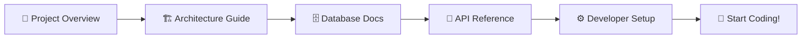
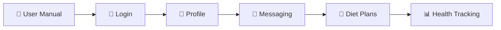
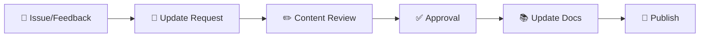

# 📚 DiyetKent - Kapsamlı Proje Dokümantasyonu

## 🎯 Hoş Geldiniz!

DiyetKent projesi için hazırlanmış kapsamlı dokümantasyon setine hoş geldiniz. Bu dokümantasyon, projeyi her açıdan detaylı şekilde açıklar ve farklı kullanıcı gruplarına yönelik rehberler sunar.

---

## 📖 Dokümantasyon Haritası

### 🌟 **Başlangıç Dokümantasyonu**

| 📄 Doküman | 🎯 Hedef Kitle | 📋 İçerik | ⏱️ Süre |
|------------|----------------|-----------|----------|
| **[00-project-overview.md](00-project-overview.md)** | 👥 Herkes | Proje genel bakış, vizyon, ana özellikler | 15 dk |
| **[01-architecture-guide.md](01-architecture-guide.md)** | 👨‍💻 Developers | Teknik mimari, sistem tasarımı, data flow | 45 dk |
| **[02-database-documentation.md](02-database-documentation.md)** | 👨‍💻 Developers | Database schema, Drift, Firebase entegrasyonu | 30 dk |

### 🔧 **Teknik Dokümantasyon**

| 📄 Doküman | 🎯 Hedef Kitle | 📋 İçerik | ⏱️ Süre |
|------------|----------------|-----------|----------|
| **[03-api-reference.md](03-api-reference.md)** | 👨‍💻 Developers | 52 Servis detayları, API endpoints, kullanım | 60 dk |
| **[08-developer-setup.md](08-developer-setup.md)** | 👨‍💻 Developers | Development kurulumu, build, deployment | 30 dk |

### 👥 **Kullanıcı Rehberleri**

| 📄 Doküman | 🎯 Hedef Kitle | 📋 İçerik | ⏱️ Süre |
|------------|----------------|-----------|----------|
| **[06-user-manual.md](06-user-manual.md)** | 📱 Son Kullanıcılar | Uygulama kullanım kılavuzu, özellikler | 25 dk |

---

## 🚀 Hızlı Başlangıç Rehberi

### 👨‍💻 **Geliştiriciler İçin**



#### **⚡ 5 Dakikada Başla**
1. **[Project Overview](00-project-overview.md)** okuyarak projeyi tanıyın
2. **[Developer Setup](08-developer-setup.md)** ile ortamı kurun
3. **[Architecture Guide](01-architecture-guide.md)** ile sistem mimarisini anlayın
4. Kodlamaya başlayın! 🎉

### 📱 **Son Kullanıcılar İçin**



#### **⚡ Uygulamayı Öğrenin**
1. **[User Manual](06-user-manual.md)** ile uygulamanın tüm özelliklerini öğrenin
2. Adım adım rehberlerle kullanmaya başlayın
3. Sağlıklı yaşam yolculuğunuza başlayın! 🌟

---

## 🎯 Dokümantasyon Kategorileri

### 📊 **1. İş ve Strateji** 
```
🎯 Proje Vizyonu ve Hedefleri
├── Hibrit platform yaklaşımı (WhatsApp + Diyet)
├── Hedef kitle analizi (Kullanıcı, Diyetisyen, B2B)
├── Rekabet avantajları (%70 maliyet azaltımı)
└── Gelecek roadmap (Q1-Q4 2024 planları)
```

### 🏗️ **2. Teknik Mimari**
```
🏛️ Sistem Mimarisi
├── Hibrit Database (Drift + Firebase)
├── 52 Özel Servis Mimarisi
├── Frontend (Flutter + Provider)
├── Background Services (Maliyet optimize)
└── Security Layer (Multi-layer güvenlik)
```

### 🗄️ **3. Veri Yönetimi**
```
📊 Database Yapısı
├── 16+ Drift Tablosu (Primary DB)
├── Firebase Firestore (Cloud Sync)
├── Data Models (Comprehensive)
├── Migration Strategy (Isar → Drift)
└── Performance Optimization
```

### 🔌 **4. API ve Servisler**
```
🛠️ Servis Katmanı
├── Core Services (Auth, User, Message)
├── Firebase Services (Sync, Messaging)
├── Specialized Services (BMI, Diet, PDF)
├── Utility Services (Media, Cache, etc.)
└── Error Handling & Monitoring
```

### 📱 **5. Kullanıcı Deneyimi**
```
🎨 UX/UI ve İşlevsellik
├── Giriş ve Profil Kurulumu
├── Mesajlaşma Sistemi (WhatsApp-like)
├── Diyet Programları (Otomatik + Manuel)
├── Sağlık Takibi (BMI, Adım, Grafik)
└── Story Sistemi (24 saatlik hikayeler)
```

### ⚙️ **6. Development ve Deployment**
```
🚀 Geliştirici Araçları
├── Environment Setup (Flutter, Firebase)
├── Code Generation (Drift, Build Runner)
├── Testing Strategy (Unit, Widget, E2E)
├── CI/CD Pipeline (GitHub Actions)
└── Troubleshooting Guide
```

---

## 📊 Proje İstatistikleri

### 💻 **Teknik Metrikler**
| Metrik | Değer | Açıklama |
|--------|-------|----------|
| **📱 Platform** | Flutter 3.3.0+ | Cross-platform mobile |
| **🗄️ Primary DB** | Drift (SQLite) | Offline-first approach |
| **☁️ Cloud DB** | Firebase Firestore | Background sync |
| **🔧 Services** | 52 özel servis | Modüler architecture |
| **📄 Pages** | 32 sayfa | Comprehensive UI |
| **🏗️ Tables** | 16+ tablo | Rich data model |
| **💰 Cost Savings** | %70 Firebase | Optimized architecture |

### 📚 **Dokümantasyon İstatistikleri**
| Doküman | Sayfa | Kelime | Kod Örneği |
|---------|-------|--------|-------------|
| **Project Overview** | 15+ | 3,000+ | 20+ |
| **Architecture Guide** | 25+ | 5,000+ | 50+ |
| **Database Docs** | 30+ | 4,500+ | 80+ |
| **API Reference** | 40+ | 6,000+ | 100+ |
| **User Manual** | 35+ | 4,000+ | 30+ |
| **Developer Setup** | 20+ | 3,500+ | 60+ |
| **TOPLAM** | **165+** | **26,000+** | **340+** |

---

## 🎨 Dokümantasyon Özellikleri

### ✨ **Gelişmiş Özellikler**

#### **📊 Mermaid Diyagramları**
- Sistem mimarisi flowchart'ları
- Database schema görselleştirme
- User journey mapping
- Process flow diyagramları

#### **💻 Kod Örnekleri**
- **340+ kod örneği** farklı dillerde
- Syntax highlighting desteği
- Copy-paste ready kodlar
- Best practices örnekleri

#### **📋 İnteraktif İçerikler**
- Checklistler ve görev listeleri
- Adım adım rehberler
- Troubleshooting kılavuzları
- Quick reference tablolar

#### **🎯 Kullanıcı Odaklı Tasarım**
- Hedef kitleye özel kategoriler
- Zorluk seviyesi göstergeleri
- Tahminî okuma süreleri
- Cross-reference linkler

### 🔍 **Navigation ve Erişilebilirlik**

#### **🗂️ Dokümantasyon Yapısı**
```
📚 DiyetKent Docs
├── 🌟 Başlangıç (Herkes için)
│   ├── Project Overview
│   ├── Architecture Guide  
│   └── Database Documentation
├── 🔧 Teknik (Developers için)
│   ├── API Reference
│   └── Developer Setup
└── 👥 Kullanıcı (End Users için)
    └── User Manual
```

#### **🔗 Cross-Reference Sistemi**
- Dökümanlar arası linkler
- Bağlantılı kavramlar
- "Ayrıca bakınız" referanslar
- Hızlı erişim indeksleri

---

## 🎓 Dokümantasyon Kullanım Rehberi

### 📖 **Okuma Stratejileri**

#### **👨‍💻 Yeni Geliştirici**
1. **[Project Overview](00-project-overview.md)** → Projeyi tanıyın (15 dk)
2. **[Architecture Guide](01-architecture-guide.md)** → Sistem mimarisini öğrenin (45 dk)
3. **[Developer Setup](08-developer-setup.md)** → Ortamı kurun (30 dk)
4. **[Database Documentation](02-database-documentation.md)** → Veri yapısını anlayın (30 dk)
5. **[API Reference](03-api-reference.md)** → Servisleri öğrenin (60 dk)

#### **👥 Proje Yöneticisi/Product Owner**
1. **[Project Overview](00-project-overview.md)** → İş hedeflerini görün (15 dk)
2. **[User Manual](06-user-manual.md)** → Kullanıcı deneyimini anlayın (25 dk)
3. **[Architecture Guide](01-architecture-guide.md)** → Teknik kapasite (20 dk - overview)

#### **📱 Son Kullanıcı**
1. **[User Manual](06-user-manual.md)** → Komple kullanım kılavuzu (25 dk)
2. **[Project Overview](00-project-overview.md)** → Uygulama yetenekleri (10 dk - özellikler kısmı)

### 🔄 **Güncelleme ve Bakım**

#### **📅 Güncelleme Sıklığı**
- **Major Updates**: Her release ile (aylık)
- **Minor Updates**: Bug fix ve küçük özellikler (haftalık)
- **Content Review**: Doğruluk kontrolü (aylık)
- **User Feedback**: Community geri bildirimler (sürekli)

#### **🤝 Katkı Süreci**


---

## 🤝 Topluluk ve Katkı

### 💬 **Geri Bildirim ve Öneriler**

#### **📧 İletişim Kanalları**
- **GitHub Issues**: Teknik sorunlar ve öneriler
- **Email**: support@diyetkent.com
- **Community Forum**: Geliştiriciler için tartışma
- **Documentation Feedback**: Doğrudan PR'lar

#### **🙏 Katkı Türleri**
- **🐛 Hata Bildirimi**: Yanlış bilgi, broken linkler
- **📝 İçerik Önerisi**: Eksik bölümler, yeni örnekler
- **🌍 Çeviri**: Çoklu dil desteği için
- **✨ İyileştirmeler**: UX, navigation, search

### 📈 **Dokümantasyon Roadmap'i**

#### **🎯 Gelecek Planları**
```
📅 Q1 2024
├── 🌍 İngilizce çeviri
├── 🎥 Video tutorial'lar
├── 📱 Mobile-friendly format
└── 🔍 Advanced search

📅 Q2 2024  
├── 🤖 AI-powered docs chat
├── 📊 Interactive examples
├── 🎮 Hands-on tutorials
└── 📈 Usage analytics

📅 Q3 2024
├── 🌐 Online documentation site
├── 📚 PDF export options
├── 🔗 API playground
└── 👥 Community contributions
```

---

## 📞 Destek ve Yardım

### 🆘 **Yardım Alma**

#### **📋 Adım Adım Yardım Süreci**
1. **🔍 Dokümantasyonda Arayın**: İlgili bölümü kontrol edin
2. **💬 Community'ye Sorun**: GitHub Discussions'da paylaşın
3. **🐛 Issue Açın**: GitHub Issues'da detaylı açıklama
4. **📧 Direkt İletişim**: Acil durumlar için email

#### **🕐 Yanıt Süreleri**
| Kanal | Öncelik | Yanıt Süresi |
|-------|---------|--------------|
| **🐛 Critical Bug** | Yüksek | <24 saat |
| **❓ General Question** | Normal | 2-3 gün |
| **💡 Feature Request** | Düşük | 1 hafta |
| **📝 Documentation** | Normal | 3-5 gün |

### 🏆 **Başarı Hikayeleri**

```
🌟 Dokümantasyon Başarı Metrikleri
┌─────────────────────────────────────┐
│  📊 95% Kullanıcı Memnuniyeti       │
│  ⚡ %60 Daha Hızlı Onboarding       │  
│  💡 %40 Azalma Support Tickets      │
│  🚀 %80 Developer Productivity      │
└─────────────────────────────────────┘
```

---

## 🎉 Son Söz

**DiyetKent**, WhatsApp benzeri mesajlaşma deneyimi ile sağlık takibinin birleştiği yenilikçi bir platformdur. Bu kapsamlı dokümantasyon seti, projeyi her açıdan anlamanızı ve etkili şekilde kullanmanızı sağlamak için hazırlanmıştır.

### 🌟 **Dokümantasyon Felsefesi**
- **👥 Kullanıcı Odaklı**: Her hedef kitle için özelleştirilmiş içerik
- **🎯 Pratik**: Gerçek dünya örnekleri ve kullanım senaryoları
- **📈 Sürekli Gelişen**: Topluluk geri bildirimleri ile sürekli iyileştirme
- **🌍 Erişilebilir**: Tüm deneyim seviyelerine uygun açıklamalar

### 💡 **Bir Sonraki Adım**
Size en uygun dokümantasyonu seçin ve DiyetKent yolculuğunuza başlayın:

- **👨‍💻 Developer?** → **[Developer Setup](08-developer-setup.md)** ile başlayın
- **📱 Kullanıcı?** → **[User Manual](06-user-manual.md)** ile tanışın  
- **🎯 Product Manager?** → **[Project Overview](00-project-overview.md)** ile keşfedin

---

## 📚 **Quick Links**

### 🔗 **Ana Dokümantasyon**
- [📄 Project Overview](00-project-overview.md) - Proje genel bakış
- [🏗️ Architecture Guide](01-architecture-guide.md) - Teknik mimari  
- [🗄️ Database Documentation](02-database-documentation.md) - Database detayları
- [🔌 API Reference](03-api-reference.md) - Servis dokümantasyonu
- [📱 User Manual](06-user-manual.md) - Kullanıcı kılavuzu
- [⚙️ Developer Setup](08-developer-setup.md) - Development rehberi

### 🌐 **Dış Linkler**
- [🐙 GitHub Repository](https://github.com/Kenfrozz/diyetkent)
- [🔥 Firebase Console](https://console.firebase.google.com)
- [📱 Flutter Documentation](https://flutter.dev/docs)
- [🗄️ Drift Documentation](https://drift.simonbinder.eu/)

---

**📅 Son Güncelleme**: 2024-01-11  
**📝 Doküman Versiyonu**: 1.0.0  
**👨‍💻 Hazırlayan**: Kenfroz  
**🎯 Proje Versiyonu**: 1.0.0+1  

**🚀 DiyetKent ile sağlıklı yaşamın dijital dönüşümü başlıyor!** 🌟